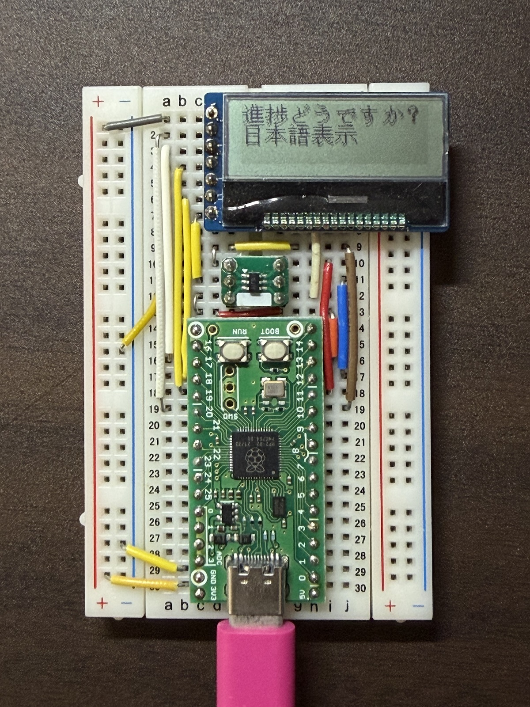

# pico-kanji-lcd



日本語フォントをAQM1248A LCDに表示します。

# 使用した機材

* RP2040マイコンボードキット
https://akizukidenshi.com/catalog/g/g117542/
* AQM1248A小型グラフィック液晶ボード  
https://www.switch-science.com/products/11022
* 日本語フォントROM GT20L16J1Yピッチ変換済みモジュール  
https://www.switch-science.com/products/2273

# デバイスとの接続

Pasberry Pi picoと他の部品は以下のように接続してください。

|Rasberry Pi pico|AQM1248A|GT20L16J1Y|
|---|---|---|
|GPIO13|CS# (3)||
|GPIO17||CS (3)|
|GPIO20||RS (2)|
|GPIO11|SI (6)||
|GPIO12|SO (5)||
|GPIO10|SCLK (1)||
|GPIO18||SCK (6)|
|GPIO19||SDI (4)|

# 必要なツールのインストール

## ツールチェインのインストール
以下の情報を参照して、ビルドに使用するツールチェインをインストールしてください。
https://pip-assets.raspberrypi.com/categories/610-raspberry-pi-pico/documents/RP-008276-DS-1-getting-started-with-pico.pdf

## pico-sdk
以下のサイトを参考にしてください。  
https://github.com/raspberrypi/pico-sdk

## picotool
以下のサイトを参考にしてください。  
https://github.com/raspberrypi/picotool

# プログラムのビルドと書き込み

## コマンドライン（cmake）でビルドする
以下のコマンドでリポジトリをクローンして、ビルドします。

### リポジトリのクローン

```bash
$ git clone https://github.com/toyowata/pico-kanji-lcd.git
$ cd pico-kanji-lcd/
$ mkdir build && cd build
```

### ビルド

PICO_SDK_PATHにPICO SDKをインストールしたパスを設定します。

```
$ export PICO_SDK_PATH=<pico-sdk-path>
```

ボード名を指定して、ビルドします。  
Raspberry Pi Pico の場合
```bash
$ cmake .. -GNinja -DPICO_BOARD=pico
$ ninja
```

Raspberry Pi Pico 2 の場合
```bash
$ cmake .. -GNinja -DPICO_BOARD=pico2
$ ninja
```

PIMORONI Tiny 2040 の場合
```bash
$ cmake .. -GNinja -DPICO_BOARD=pimoroni_tiny2040
$ ninja
```

## Raspberry Pi pico に書き込む
BOOTSELモードに設定し（基板上のボタンを押したまま電源を入れる）、以下のコマンドを実行します。

```bash
$ picotool load ./pico-kanji-lcd.uf2
```

## プログラムの実行

プログラム書き込み後、自動的にリセットされプログラムが起動します。  
